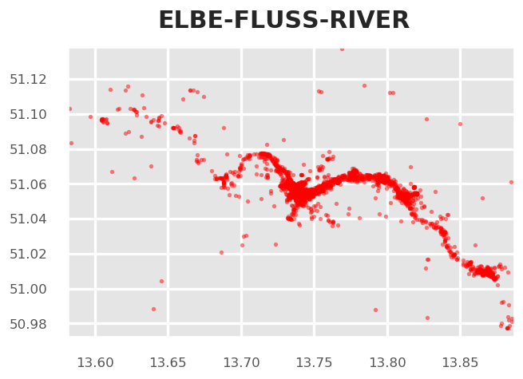
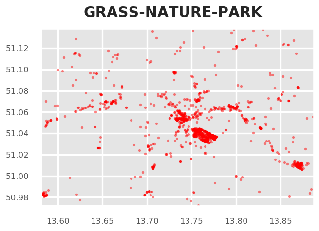
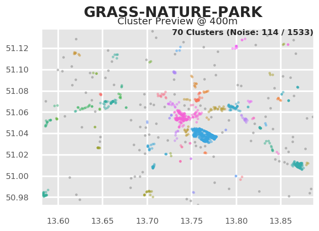
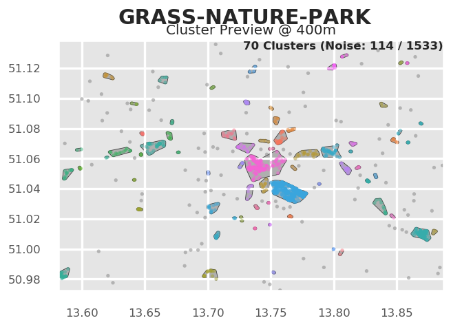
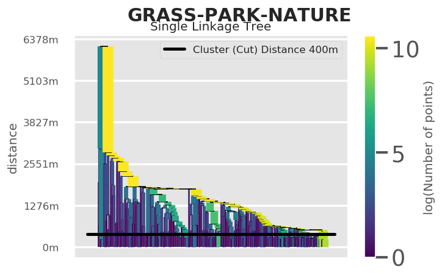
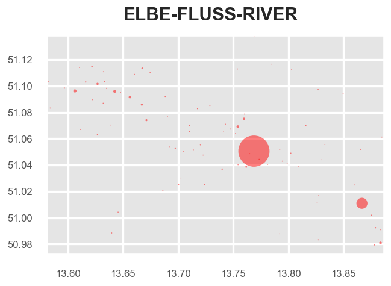

# Jupyter Lab examples

Tagmaps package can be imported to Jupyter notebook or Jupyter lab with `from tagmaps import TagMaps`. In Jupyter, it is currently not possible to visualize final word clouds. However, several intermediate functions are available and can be used to filter and preview data. The clustered data available from tagmaps can be used to develop own visualization techniques in Jupyter.

## Extracting common areas of interest for given topics from LBSM

The task in the notebook presented here is to extract and visualize common areas or regions of interest for a given topic from Location Based Social Media (LBSM) data. On Social Media, people react to many things, and a significant share of these reactions can be seen as forms of valuation or attribution of meaning to to the physical environment. However, for visualizing such values for whole cities, there are several challenges involved:

* Identify reactions that are related to a given topic: Topics can be considered at different levels of granularity and equal terms may convey different meanings in different contexts
* Social Media data is distributed very irregularly with lots of noise. Data peaks in urban areas and highly frequented tourist hotspots, while some less frequented areas do not feature any data at all. When visualizing spatial reactions to topics, this inequal distribution must be taken into account, otherwise maps will be biased towards areas with higher density of information. For this reason, normalizing results is crucial. The usual approach for normalization in such cases is that local distribution is evaluated against the global (e.g. spatial) distribution data

Start jupyter lab (`jupyter lab` or `jupyter notebook`) and create an empty jupyter notebook. Copy code cells below into the notebook to follow this guide.

For development purposes only, it is possible to enable auto reload of develop dependencies with:

```python
%load_ext autoreload
%autoreload 2
#%autoreload tagmaps
```

This is only necessary if you installed tagmaps with `python setup.py develop --no-deps` (e.g.)

Load the TagMaps package, which will serve as a base for filtering, cleaning and processing noisy social media data:

```python
from tagmaps import TagMaps
from tagmaps import EMOJI, TAGS, LOCATIONS, TOPICS
from tagmaps import LoadData
from tagmaps import BaseConfig
from tagmaps.classes.utils import Utils
```

### Load Data & Overview


```python
tm_cfg = BaseConfig()
```

    Loaded 320 stoplist items.
    Loaded 214 inStr stoplist items.
    Loaded 3 stoplist places.


Initialize tag maps from BaseConfig


```python
tm = TagMaps(
    tag_cluster=tm_cfg.cluster_tags,
    emoji_cluster=tm_cfg.cluster_emoji,
    location_cluster=tm_cfg.cluster_locations,
    output_folder=tm_cfg.output_folder,
    remove_long_tail=tm_cfg.remove_long_tail,
    limit_bottom_user_count=tm_cfg.limit_bottom_user_count,
    max_items=tm_cfg.max_items,
    topic_cluster=True)
```

#### a) Read from original data

Read input records from raw-csv:

```python
input_data = LoadData(tm_cfg)
with input_data as records:
    for record in records:
        tm.add_record(record)
input_data.input_stats_report()tm.lbsn_data.write_cleaned_data(panon=False)
```

#### b) Read from pre-filtered intermediate data

Read data form (already prepared) cleaned output. Cleaned output is a filtered version of original data of type UserPostLocation (UPL), which is a reference in tagmaps as 'CleanedPost'. A UPL simply has all posts of a single user at a single coordinate merged, e.g. a reduced list of terms, tags and emoji based on global occurrence (i.e. no duplicates).
there're other metrics used throughout the tagmaps package, which will become handy for measuring topic reactions here:

- UPL - User post location
- UC - User count
- PC - Post count
- PTC - Total tag count ("Post Tag Count")
- PEC - Total emoji count
- UD - User days (counting distinct users per day)
- DTC - Total distinct tags
- DEC - Total distinct emoji
- DLC - Total distinct locations


```python
tm.prepare_data(input_path='01_Input/Output_cleaned_flickr.csv')
```

Print stats for input data.


```python
tm.global_stats_report()
tm.item_stats_report()
```

    Total user count (UC): 5991
    Total user post locations (UPL): 67434
    Total distinct tags (DTC): 1000
    Total distinct emoji (DEC): 0
    Total distinct locations (DLC): 66093
    Total tag count for the 1000 most used tags in selected area: 252510.
    Total emoji count for the 1000 most used emoji in selected area: 0.
    Bounds are: Min 13.581848 50.972288 Max 13.88668 51.138001


## Topic Selection & Clustering

The next goal is to select reactions to given topics. TagMaps allows selecting posts for 4 different types:
- TAGS (i.e. single terms)
- EMOJI (i.e. single emoji)
- LOCATIONS (i.e. named POIs or coordinate pairs)
- TOPICS (i.e. list of terms)

Set basic plot to notebook mode and disable interactive plots for now


```python
import matplotlib.pyplot as plt
#%matplotlib notebook
%matplotlib inline
import matplotlib as mpl
mpl.rcParams['savefig.dpi'] = 120
mpl.rcParams['figure.dpi'] = 120
```

We can retrieve preview maps for the TOPIC dimension by supplying a list of terms, for example "elbe", "fluss" and "river" should give us an overview where such terms are used in our sample area


```python
fig = tm.get_selection_map(TOPICS,["elbe","fluss","river"])
```





This approach is good for terms that clearly relate to specific and named physical aspects such as the "elbe" river, which exists only once.
Selecting reactions from a list of terms is more problematic for general topics such as park, nature and "green-related" activities.
Have a look:


```python
fig = tm.get_selection_map(TOPICS,["grass","nature","park"])
```





We can see some areas of increased coverage: the Großer Garten, some parts of the Elbe River. But also the city center, which may show a representative picture. However, there's a good chance that we catched many false-positives and false-negatives with this clear-cut selection.

**Topic Vectors**
A better approach would be to select Topics based on "Topic-Vectors", e.g. after a list of terms is supplied, a vector is calculated that represents this topic. This topic vector can then be used to select posts that have similar vectors. Using a wide or narrow search angle, the broadness of selection can be affected. This is currently not implemented here but an important future improvement.

### HDBSCAN Cluster

We can visualize clusters for the selected topic using HDBSCAN. The important parameter for HDBSCAN is the cluster distance, which is chosen automatically by Tag Maps given the current scale of analysis. In the following, we manually reduce the cluster distance from 800 to 400, so we can a finer grained picture of topic clusters.


```python
# tm.clusterer[TOPICS].autoselect_clusters = False
tm.clusterer[TOPICS].cluster_distance = 400
fig = tm.get_cluster_map(TOPICS,["grass","nature","park"])
```





Equally, we can get a map of clusters and cluster shapes (convex and concave hulls).


```python
tm.clusterer[TOPICS].cluster_distance = 400
fig = tm.get_cluster_shapes_map(TOPICS,["grass","nature","park"])
```

    --> 70 cluster.





Behind the scenes, Tag Maps utilizes the Single Linkage Tree from HDBSCAN to cut clusters at a specified distance. This tree shows the hierarchical structure for our topic and its spatial properties in the given area.


```python
fig = tm.get_singlelinkagetree_preview(TOPICS,["grass", "park", "nature"])
```





The cluster distance can be manually set. If autoselect clusters is True, HDBSCAN will try to identify clusters based on its own algorithm.


```python
tm.clusterer[TOPICS].cluster_distance = 400
# tm.clusterer[TOPICS].autoselect_clusters = False
```

### Cluster centroids

Similarly, we can retrieve centroids of clusters. This shows again the unequal distribution of data:


```python
fig = tm.clusterer[TOPICS].get_cluster_centroid_preview(["elbe","fluss","river"])
```

    (1 of 1000) Found 4599 posts (UPL) for Topic 'elbe-fluss-river' (found in 7% of DLC in area) --> 28 cluster.





To get only the important clusters, we can drop all single cluster items:


```python
# tm.clusterer[TOPICS].get_cluster_centroid_preview(["elbe", "fluss", "river"])
fig = tm.clusterer[TOPICS].get_cluster_centroid_preview(["elbe","fluss","river"], single_clusters=False)
```

    (1 of 1000) Found 4599 posts (UPL) for Topic 'elbe-fluss-river' (found in 7% of DLC in area) --> 28 cluster.


